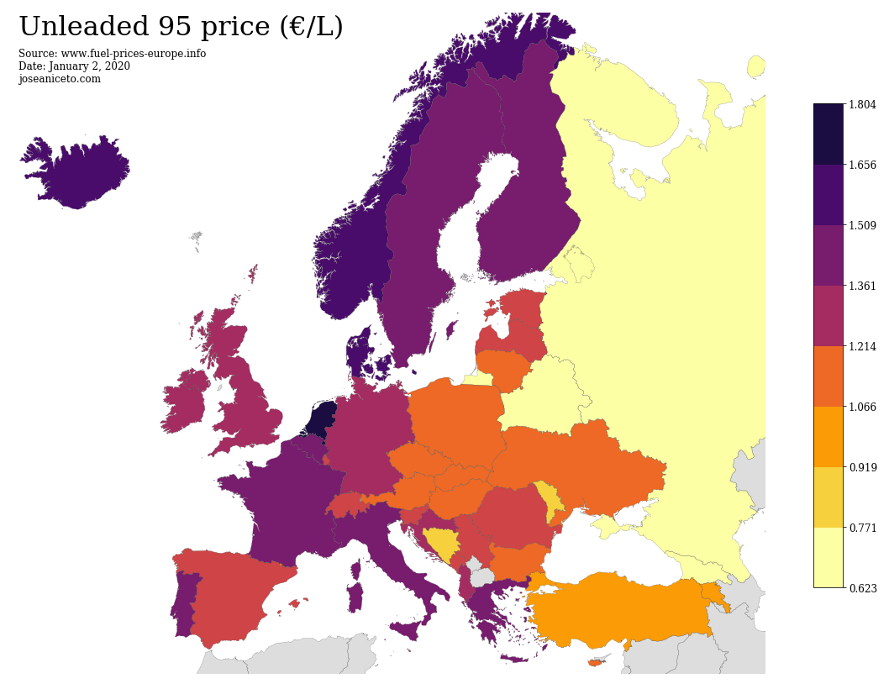
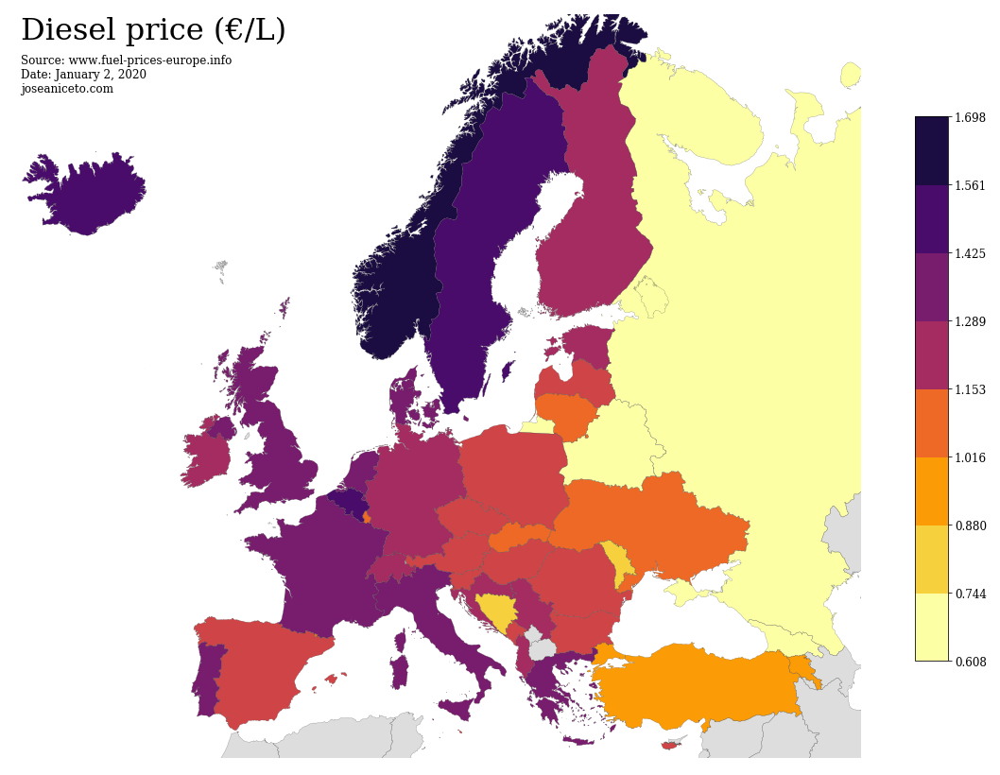
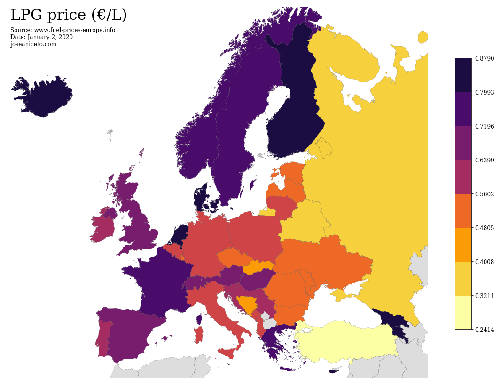
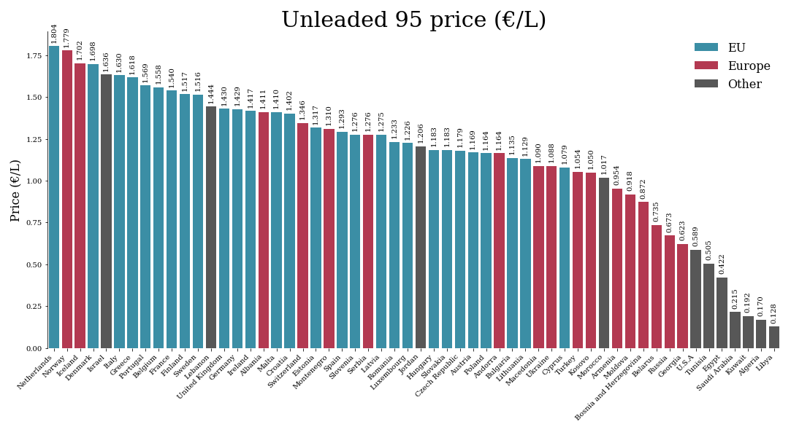
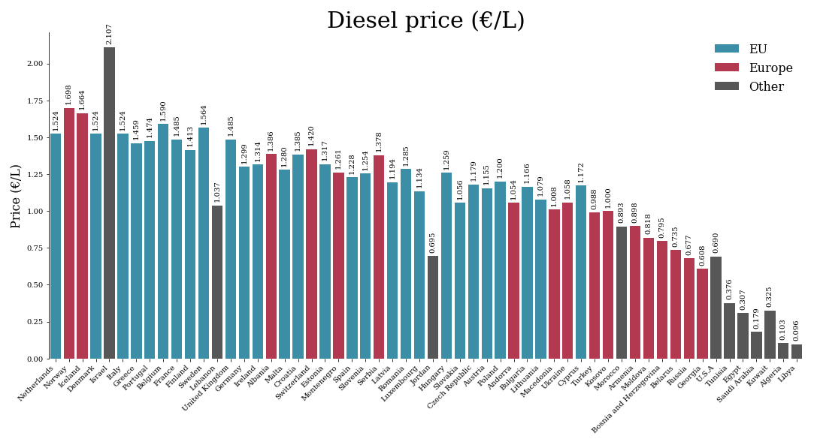
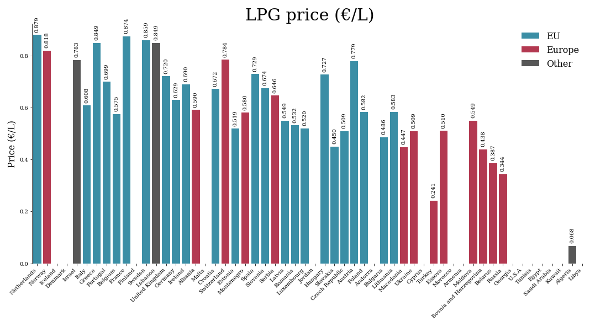

## Including non-european countries

Countries ordered from highest to lowest Unleaded 95 price. 

## Data

Data was collected from fuel-prices-europe.info on January 2, 2020.

- [Data source](http://www.fuel-prices-europe.info/)

## Source code

IPython notebooks with data treatment and visualizations can be found at: 

- [Data treatment](https://github.com/jAniceto/data-viz/blob/master/europe-fuel-prices/data-treatment.ipynb)
- [Choropleth visualizations](https://github.com/jAniceto/data-viz/blob/master/europe-fuel-prices/europe-fuel-prices.ipynb)
- [Other visualizations](https://github.com/jAniceto/data-viz/blob/master/europe-fuel-prices/europe-fuel-prices-2.ipynb)